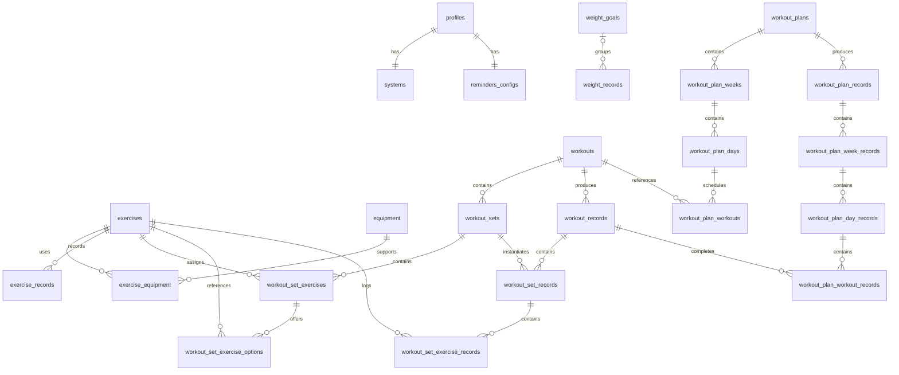

# My Fitness Tale

My Fitness Tale is a local-first fitness tracker for Android and iOS. The app keeps fitness data in
an on-device SQLite database which acts as the main source of truth.

> **Project status:** active development. The Flutter mobile app is the only
> client currently implemented and is suitable for continued development and
> simulator testing. It is not ready for release or for storing irreplaceable
> data because backup and restore are not available yet.

## What works today

- Guided onboarding with an optional library of starter workouts;
- Profile, theme, unit, and reminder-preference settings;
- Equipment and exercise management;
- Exercise records and progress charts;
- Reusable basic and advanced workouts;
- Live workout tracking and workout history;
- Weight records, charts, and weight goals;
- Multi-week workout plans, active-plan progress, and plan history.

Reminder switches currently save preferences only, they do not schedule notifications yet. Premium
purchases still in development.

For the detailed implementation snapshot and known limitations, see
[PROJECT_STATE.md](PROJECT_STATE.md).

## Project direction

The long-term goal is a private, local-first fitness tracker that brings the main parts of training
into one single mobile APP:

1. Exercise and progress tracking;
2. Workouts and workout plans;
3. Weight and weight-goal tracking;
4. Meals and macros;
5. Local-first AI personal trainer.

The goal is for it to be divided in 4 components:

1. the Flutter mobile app;
2. an Apple Watch and Wear OS companion focused on workouts;
3. an IDP REST service built in the [DevLogs repo](https://github.com/tugascript/devlogs);
4. a main gRPC service for encrypted backup/sync, subscription verification, and AI model updates.

Only the mobile app exists in this repository today. Meals and macros, the AI trainer, watch apps,
accounts, and cloud services are roadmap items, not current features. Gamification and social
networking existing on the original BuffQuest are outside the first major release. The ordered
roadmap is in [project.md](project.md).

## Getting started

### Requirements

- a Flutter SDK compatible with Dart `^3.5.4`;
- Android Studio or Xcode for the target platform;
- an Android emulator/device or iOS simulator/device.

Install dependencies and run the app from the repository root:

```sh
flutter pub get
flutter run
```

No cloud account or backend is needed for the implemented mobile flows.

## Development checks

Run the standard checks before submitting a change:

```sh
dart format --output=none --set-exit-if-changed lib test integration_test
dart analyze
flutter test
git diff --check
```

Device journeys live in `integration_test/` and can be run against a selected target:

```sh
flutter devices
flutter test integration_test -d <device-id>
```

The test harness uses a dedicated `integration_test.db` and refuses to delete data while the
production `app.db` is selected.

## How the app is organized

It follows a typical MVC flow with the following components:

```text
SQLite model -> repository/service -> Cubit -> view/widget
```

- **Models** define SQLite tables and map database rows.
- **Repositories and services** handle queries, validation, relationships, and
  transactions.
- **Cubits** expose feature state to the UI.
- **Views and widgets** render routed screens and reusable interface elements.
- **GoRouter** connects the four main areas: Home, Plans, Activity, and Profile.

```text
.
├── android/                # Android host project
├── assets/                 # Fonts, icons, and seed JSON
├── integration_test/       # Android/iOS journey tests
├── ios/                    # iOS host project
├── lib/
│   ├── main.dart           # Application entry point
│   ├── my_app.dart         # Root app, providers, and router
│   └── src/
│       ├── common/         # Shared helpers
│       ├── cubits/         # Application state
│       ├── models/         # SQLite models and repositories
│       ├── services/       # Domain operations and DTOs
│       ├── utilities/      # Routing, theme, conversion, and sizing
│       ├── views/          # Route-level screens
│       └── widgets/        # Feature UI components
├── test/                   # Unit and widget tests
├── tools/                  # Local development helpers
├── PROJECT_STATE.md        # What is implemented now
└── project.md              # What should be built next
```

Feature folders are grouped around equipment, exercises, profile, weight, workouts, and workout
plans.

### Local data model

`DatabaseHelper` in `lib/src/models/db.dart` creates the SQLite schema and enables foreign-key
enforcement. The diagram below intentionally shows domain relationships rather than every column;
the model files are the authoritative schema definition.

<details>
<summary>Show the entity-relationship diagram</summary>



</details>

## Documentation map

- [README.md](README.md): product overview, setup, and architecture orientation;
- [PROJECT_STATE.md](PROJECT_STATE.md): code-grounded capabilities, invariants, test evidence, and
  limitations;
- [project.md](project.md): priorities, sequencing, and release criteria.

When behavior changes, update the project state. When priorities or scope change, update the
delivery plan. Keep this README focused on helping a new contributor understand and run the project.

## License

My Fitness Tale is licensed under the [GNU General Public License v3.0](LICENSE).
